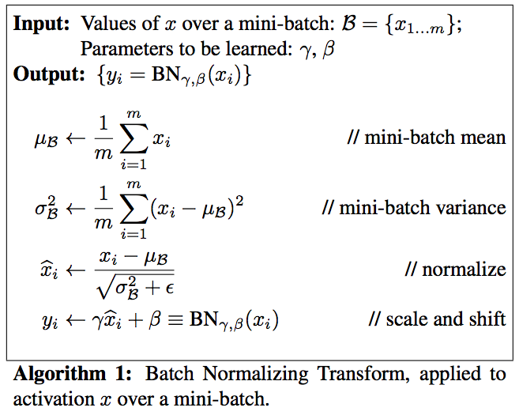

# deep-learning

A personal Deep Learning practice repository based on [this book](https://www.oreilly.co.jp/books/9784873117584/) and the [repository](https://github.com/oreilly-japan/deep-learning-from-scratch).

## Installation

- [Anaconda](https://www.continuum.io/downloads) (Python 3, NumPy, Matplotlib)

## Memo

### Batch Normalization

* [Batch Normalization: Accelerating Deep Network Training by Reducing Internal Covariate Shift](http://jmlr.org/proceedings/papers/v37/ioffe15.pdf)

